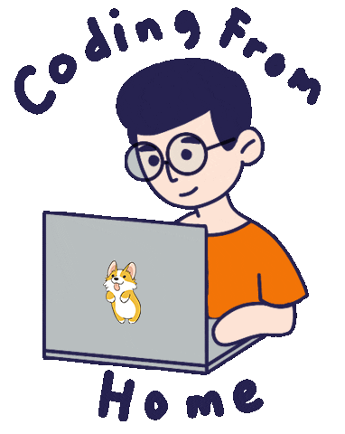

### Hello, My name is Vladimir 
### I am a software developer 

[](https://www.linkedin.com/in/vyazovetskov/)
[](https://t.me/erhosen)
[](mailto:erhosen@gmail.com)


### A little more about me...  

```python
class ErhoSen:
    current_role = "Software Engineer"
    technologies = {
        "Backend": ["Python", "Kotlin", "GoLang", "Django", "FastAPI"],
        "Frontend": ["JavaScript", "TypeScript", "Swift"],
        "DevOps": ["Docker", "Docker-Compose", "Kubernetes", "CI/CD"],
        "Databases": ["PostgreSQL", "MongoDB", "SQLite", "ElasticSearch", "Redis"],
        "Other": ["RabbitMQ", "Kafka", "TDD"]
    }
    architecture = ["Microservices", "REST APIs", "Serverless"]
```

